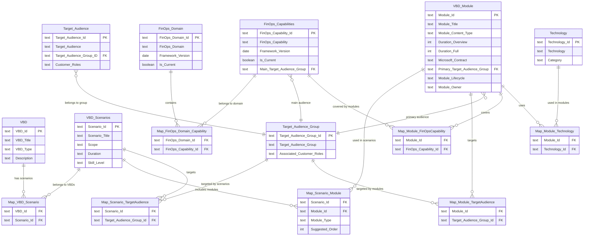

# FinOps & Cost Management Workshop — Data Model Documentation

> **Source file:** `FinOpsCost-Module-Repository.xlsx`
> **Last updated:** 2026-02-18

This document describes the data model used in the FinOps & Cost Management Module Repository. The model captures workshops (VBDs), their scenarios, deliverable modules, target audiences, FinOps framework alignment, and associated technologies. It is designed to support workshop planning, module discovery, and FinOps capability mapping.

---

## Table of Contents

1. [Entity Tables](#entity-tables)
2. [Bridge / Mapping Tables](#bridge--mapping-tables)
3. [Lookup Lists](#lookup-lists)
4. [Entity-Relationship Diagram (Mermaid)](#entity-relationship-diagram)
5. [Relationship Summary](#relationship-summary)
6. [Key Concepts for AI & Consumers](#key-concepts-for-ai--consumers)

---

## Entity Tables

### VBD (Workshops)

**Sheet:** `VBD` · **Primary Key:** `VBD Id`

Represents the top-level workshop offerings.

| Column | Type | Description |
|---|---|---|
| VBD Id | Text (PK) | Unique identifier for the workshop (e.g. `WSACO`) |
| VBD Title | Text | Full title of the workshop |
| VBD Type | Text | Type of delivery — values from [VBD Type list](#lookup-lists) |
| Description | Text | Detailed description of the workshop purpose and scope |
| IP Kit | URL | Link to the IP Kit resource |
| Datasheet | URL | Link to the datasheet |
| Learning Path | URL | Link to an associated learning path |
| Additional Information | Text | Optional notes |
| Last modified date | Date | Last modification timestamp |

**Current records:** 2 workshops (Knowledge Transfer; Implementation / Value realization)

---

### VBD Scenarios

**Sheet:** `VBD Scenarios` · **Primary Key:** `Scenario Id`

Scenarios are delivery variants within a workshop, each targeting a specific audience and skill level with a defined scope and duration.

| Column | Type | Description |
|---|---|---|
| Scenario Id | Text (PK) | Unique identifier (e.g. `S-F-01`, `S-P-01`) |
| Scenario Title | Text | Name of the scenario |
| Scope | Text | `Predefined` or `Generic` |
| Duration | Text | Estimated duration (e.g. `3 days`, `[1,2,4] days`) |
| Skill Level | Text | Required skill level (e.g. `Level 300+`, `Level 400`) |
| Prerequisites | Text | Prerequisites for participants |
| Description | Text | Detailed description |
| Additional Information | Text | Optional notes |
| Last modified date | Date | Last modification timestamp |

**Current records:** 4 scenarios

---

### VBD Module

**Sheet:** `VBD Module` · **Primary Key:** `Module Id`

Modules are the atomic content units that can be assembled into scenarios. Each module has content, outcomes, duration, ownership, and lifecycle metadata.

| Column | Type | Description |
|---|---|---|
| Module Id | Text (PK) | Unique identifier (e.g. `M-001`) |
| Module Title | Text | Full title of the module |
| Module Content Type | Text | `Content Module`, `Engagement specific Module`, or `Other Module` — see [Module Content Type list](#lookup-lists) |
| Duration Overview | Integer | Duration in minutes for an overview delivery |
| Duration Full | Integer | Duration in minutes for a full delivery |
| Microsoft Contract | Text | Applicable contract scope — see [Contract list](#lookup-lists) |
| Content | Text (multiline) | Detailed content outline (bullet points) |
| Outcome | Text (multiline) | Expected outcomes after completing the module |
| Primary Target Audience Group | Text (FK) | References `Target Audience Group Id` — the primary audience for this module |
| Module Owner | Text | Alias of the module owner |
| Additional Information | Text | Optional notes |
| Associated Artefacts | Text | Links or references to supporting artefacts |
| Module Lifecycle | Text | Lifecycle stage — see [Module Lifecycle list](#lookup-lists) |
| Module first release date | Date | Date when the module was first released |
| Module last modified | Date | Date when the module content was last modified |
| Last modified date | Date | Row-level last modification timestamp |

**Current records:** 59 modules

---

### Target Audience Group

**Sheet:** `Target Audience Group` · **Primary Key:** `Target Audience Group Id`

High-level grouping of audiences (e.g. FinOps teams vs. Product teams vs. combined).

| Column | Type | Description |
|---|---|---|
| Target Audience Group Id | Text (PK) | Unique identifier (e.g. `TAG-1`) |
| Target Audience Group | Text | Name of the group (e.g. `FinOps`, `Product`, `Both`) |
| Associated Customer roles | Text (multiline) | List of typical customer roles in this group |
| Audience type | Text | Optional audience type classification |
| Additional Information | Text | Optional notes |
| Last modified | Date | Last modification timestamp |

**Current records:** 3 groups (TAG-1 FinOps, TAG-2 Product, TAG-3 Both)

---

### Target Audience

**Sheet:** `Target Audience` · **Primary Key:** `Target Audience Id`

Specific audience segments within a Target Audience Group.

| Column | Type | Description |
|---|---|---|
| Target Audience Id | Text (PK) | Unique identifier (e.g. `TA-1`) |
| Target Audience | Text | Name of the audience (e.g. `FinOps Teams`, `Product Teams`) |
| Target Audience Group ID | Text (FK) | References `Target Audience Group Id` |
| Customer roles | Text (multiline) | Specific roles within this audience |
| Additional Information | Text | Optional notes |
| Last modified | Date | Last modification timestamp |

**Current records:** 4 audiences (FinOps Teams, Product Teams, Finance, Procurement)

---

### FinOps Domain

**Sheet:** `FinOps Domain` · **Primary Key:** `FinOps Domain Id`

The high-level domains of the FinOps Framework.

| Column | Type | Description |
|---|---|---|
| FinOps Domain Id | Text (PK) | Unique identifier (e.g. `FD-1`) |
| FinOps Domain | Text | Domain name |
| Framework Version | Date | FinOps Framework version date (e.g. `2025-03-01`) |
| Is current? | Boolean | Whether this domain is current in the active framework version |
| Additional Information | Text | Optional notes |
| Last modified date | Date | Last modification timestamp |

**Current records:** 4 domains

| Id | Domain |
|---|---|
| FD-1 | Understand usage and cost |
| FD-2 | Quantify business value |
| FD-3 | Optimize usage and cost |
| FD-4 | Manage the FinOps practice |

---

### FinOps Capabilities

**Sheet:** `FinOps Capabilities` · **Primary Key:** `FinOps Capability Id`

Individual capabilities within the FinOps Framework, each belonging to a domain (via bridge table).

| Column | Type | Description |
|---|---|---|
| FinOps Capability Id | Text (PK) | Unique identifier (e.g. `FC-1`) |
| FinOps Capability | Text | Capability name |
| Framework Version | Date | FinOps Framework version date |
| Is current? | Boolean | Whether this capability is current in the active framework version |
| Additional Information | Text | Optional notes |
| Main Target Audience Group | Text (FK) | References `Target Audience Group Id` — indicates which audience group this capability primarily concerns |
| Last modified date | Date | Last modification timestamp |

**Current records:** 22 capabilities (FC-1 through FC-22)

---

### Technology

**Sheet:** `Technology` · **Primary Key:** `Technology Id`

Technologies and frameworks that can be associated with modules for search and discovery.

| Column | Type | Description |
|---|---|---|
| Technology Id | Text (PK) | Unique identifier (e.g. `T-1`) |
| Technology | Text | Technology name (e.g. `AI`, `Virtual Machines`, `AKS`) |
| Category | Text | Grouping category — see [Technology Category list](#lookup-lists) |
| Additional Information | Text | Optional notes |
| Last modified date | Date | Last modification timestamp |

**Current records:** 10 technologies

---

## Bridge / Mapping Tables

All bridge tables follow a consistent pattern: they contain the foreign key columns from both sides of the relationship, denormalized display names for readability, plus `Additional Information` and `Last modified date` columns.

### Map-VBD-Scenario

**Sheet:** `Map-VBD-Scenario` · **Relationship:** VBD ↔ Scenario (Many-to-Many)

Links workshops to their available scenarios.

| Column | Role |
|---|---|
| VBD Id | FK → `VBD.VBD Id` |
| VBD | Denormalized display name |
| Scenario Id | FK → `VBD Scenarios.Scenario Id` |
| Scenario | Denormalized display name |
| Additional Information | Optional notes |
| Last modified date | Timestamp |

**Current records:** 4 mappings

---

### Map-Scenario-Module

**Sheet:** `Map-Scenario-Module` · **Relationship:** Scenario ↔ Module (Many-to-Many)

Defines which modules belong to a scenario, including ordering and inclusion type.

| Column | Role |
|---|---|
| Scenario Id | FK → `VBD Scenarios.Scenario Id` |
| Scenario | Denormalized display name |
| Module Id | FK → `VBD Module.Module Id` |
| Module | Denormalized display name |
| Module Type | Inclusion type: `mandatory`, `recommended`, or `optional` |
| Suggested Order | Integer sort key for delivery sequence |
| Additional Information | Optional notes |
| Last modified date | Timestamp |

**Current records:** 108 mappings

> **Note:** This is the richest bridge table — it carries the `Module Type` (mandatory / recommended / optional) and `Suggested Order` attributes that define how modules are assembled into a scenario.

---

### Map-Scenario-TargetAudience

**Sheet:** `Map-Scenario-TargetAudience` · **Relationship:** Scenario ↔ Target Audience Group (Many-to-Many)

Associates scenarios with their target audience groups.

| Column | Role |
|---|---|
| Scenario Id | FK → `VBD Scenarios.Scenario Id` |
| Scenario | Denormalized display name |
| Target Audience Group Id | FK → `Target Audience Group.Target Audience Group Id` |
| Target Audience Group | Denormalized display name |
| Additional Information | Optional notes |
| Last modified date | Timestamp |

**Current records:** 4 mappings

---

### Map-Module-TargetAudience

**Sheet:** `Map-Module-TargetAudience` · **Relationship:** Module ↔ Target Audience Group (Many-to-Many)

Maps modules to relevant target audience groups (beyond the module's primary audience).

| Column | Role |
|---|---|
| Module Id | FK → `VBD Module.Module Id` |
| Module | Denormalized display name |
| Target Audience Group Id | FK → `Target Audience Group.Target Audience Group Id` |
| Target Audience | Denormalized display name |
| Additional Information | Optional notes |
| Last modified date | Timestamp |

**Current records:** 59 mappings

---

### Map-FinOps-Domain-Capability

**Sheet:** `Map-FinOps-Domain-Capability` · **Relationship:** FinOps Domain ↔ FinOps Capability (Many-to-Many)

Defines which capabilities belong to which FinOps domains.

| Column | Role |
|---|---|
| FinOps Domain Id | FK → `FinOps Domain.FinOps Domain Id` |
| FinOps Domain | Denormalized display name |
| FinOps Capability Id | FK → `FinOps Capabilities.FinOps Capability Id` |
| FinOps Capability | Denormalized display name |
| Additional Information | Optional notes |
| Last modified date | Timestamp |

**Current records:** 22 mappings

---

### Map-Module-FinOpsCapability

**Sheet:** `Map-Module-FinOpsCapability` · **Relationship:** Module ↔ FinOps Capability (Many-to-Many)

Tags modules with the FinOps capabilities they cover — key for capability-based module discovery.

| Column | Role |
|---|---|
| Module Id | FK → `VBD Module.Module Id` |
| Module | Denormalized display name |
| FinOps Capability Id | FK → `FinOps Capabilities.FinOps Capability Id` |
| FinOps Capability | Denormalized display name |
| Additional Information | Optional notes |
| Last modified date | Timestamp |

**Current records:** 74 mappings

---

### Map-Module-Technology

**Sheet:** `Map-Module-Technology` · **Relationship:** Module ↔ Technology (Many-to-Many)

Tags modules with relevant technologies — key for technology-based module discovery.

| Column | Role |
|---|---|
| Module Id | FK → `VBD Module.Module Id` |
| Module | Denormalized display name |
| Technology Id | FK → `Technology.Technology Id` |
| Technology | Denormalized display name |
| Additional Information | Optional notes |
| Last modified date | Timestamp |

**Current records:** 67 mappings

---

## Lookup Lists

**Sheet:** `Lists`

Contains controlled vocabulary values used for data validation across entity tables.

| List Name | Values | Used In |
|---|---|---|
| **Contract** | `Enterprise Agreement (EA)`, `Microsoft Customer Agreement (MCA-E)`, `Contract agnostic` | `VBD Module.Microsoft Contract` |
| **VBD Type** | `Knowledge Transfer`, `Implementation / Value realization`, `Other` | `VBD.VBD Type` |
| **Technology Category** | `Microsoft Azure`, `Microsoft other technology`, `Microsoft Frameworks`, `Industry Frameworks`, `Business`, `Open Source Solutions`, `3rd Party Solution`, `Other` | `Technology.Category` |
| **Module Type** (inclusion) | `mandatory`, `recommended`, `optional` | `Map-Scenario-Module.Module Type` |
| **Module Content Type** | `Content Module`, `Engagement specific Module`, `Other Module` | `VBD Module.Module Content Type` |
| **Module Lifecycle** | `00 - Envisioned`, `10 - In Development`, `20 - In Review`, `30 - Published & Maintained`, `40 - Sunset, not maintained`, `90 - Retired` | `VBD Module.Module Lifecycle` |

---

## Entity-Relationship Diagram

---

## Relationship Summary

The table below summarizes every relationship in the model. **Cardinality** describes the link from left entity to right entity.

| From Entity | Relationship | To Entity | Cardinality | Bridge Table | Notes |
|---|---|---|---|---|---|
| VBD | has | VBD Scenarios | Many-to-Many | `Map-VBD-Scenario` | A VBD can offer multiple scenarios; a scenario could theoretically belong to multiple VBDs |
| VBD Scenarios | includes | VBD Module | Many-to-Many | `Map-Scenario-Module` | Carries `Module Type` (mandatory/recommended/optional) and `Suggested Order` |
| VBD Scenarios | targets | Target Audience Group | Many-to-Many | `Map-Scenario-TargetAudience` | Which audience groups a scenario is designed for |
| VBD Module | targets | Target Audience Group | Many-to-Many | `Map-Module-TargetAudience` | Broad audience mapping for modules |
| VBD Module | primary audience | Target Audience Group | Many-to-One | *(direct FK on VBD Module)* | `Primary Target Audience Group` column on VBD Module |
| Target Audience | belongs to | Target Audience Group | Many-to-One | *(direct FK on Target Audience)* | `Target Audience Group ID` column on Target Audience |
| FinOps Domain | contains | FinOps Capabilities | Many-to-Many | `Map-FinOps-Domain-Capability` | Aligns capabilities to framework domains |
| FinOps Capabilities | main audience | Target Audience Group | Many-to-One | *(direct FK on FinOps Capabilities)* | `Main Target Audience Group` column |
| VBD Module | covers | FinOps Capabilities | Many-to-Many | `Map-Module-FinOpsCapability` | Which FinOps capabilities a module addresses |
| VBD Module | uses | Technology | Many-to-Many | `Map-Module-Technology` | Technologies associated with a module for search/discovery |

---

## Key Concepts for AI & Consumers

### Navigation Paths

To answer common questions, follow these traversal paths:

- **"Which modules should I deliver for scenario X?"**
  `VBD Scenarios` → `Map-Scenario-Module` → `VBD Module` (use `Suggested Order` for sequencing, `Module Type` for inclusion priority)

- **"Which FinOps capabilities does module Y cover?"**
  `VBD Module` → `Map-Module-FinOpsCapability` → `FinOps Capabilities`

- **"Which modules cover FinOps capability Z?"**
  `FinOps Capabilities` → `Map-Module-FinOpsCapability` → `VBD Module`

- **"Which FinOps domain does capability Z belong to?"**
  `FinOps Capabilities` → `Map-FinOps-Domain-Capability` → `FinOps Domain`

- **"What technologies are covered in module Y?"**
  `VBD Module` → `Map-Module-Technology` → `Technology`

- **"Which modules are relevant to a given audience group?"**
  `Target Audience Group` → `Map-Module-TargetAudience` → `VBD Module`

- **"What is the full workshop structure?"**
  `VBD` → `Map-VBD-Scenario` → `VBD Scenarios` → `Map-Scenario-Module` → `VBD Module`

### Denormalized Names in Bridge Tables

All bridge tables include human-readable name columns (e.g. `VBD`, `Scenario`, `Module`, `FinOps Capability`) alongside the ID foreign keys. These are **denormalized for readability** — the authoritative data lives in the entity tables. Always join on ID columns, not name columns.

### Module Assembly Rules

When assembling a scenario delivery plan:

1. **Mandatory** modules must be included
2. **Recommended** modules should be included unless time constraints prevent it
3. **Optional** modules are included based on customer needs
4. **Suggested Order** defines the delivery sequence (lower numbers first)

### Module Lifecycle

Only modules with lifecycle `30 - Published & Maintained` should be considered active and ready for delivery. Other stages indicate modules that are planned (`00`, `10`, `20`), deprecated (`40`), or retired (`90`).

### Contract Scope

Modules may be scoped to a specific Microsoft agreement type (`Enterprise Agreement`, `Microsoft Customer Agreement`) or be `Contract agnostic`. Filter on `Microsoft Contract` when the customer's agreement type is known.

### Data Quality Notes

- The `VBD Module.Primary Target Audience Group` column may reference Target Audience Group IDs (e.g. `TAG-5`) that do not exist in the `Target Audience Group` table. Consumers should handle missing lookups gracefully.
- Bridge tables use denormalized names that may drift from entity table values — always join on IDs.
